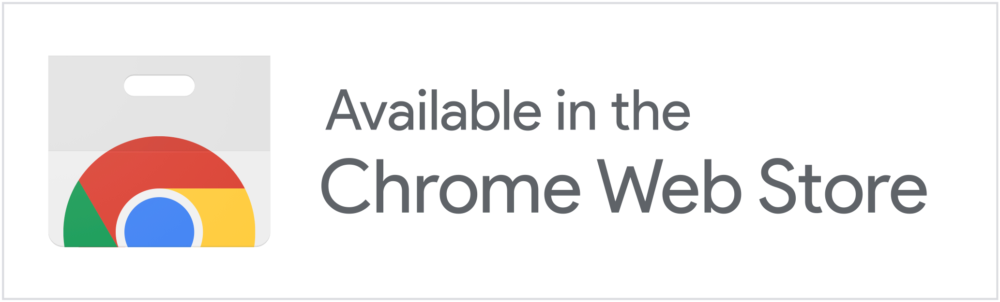

# YouTube Comment Language Filter

## Installation

### Manual Install
1. Download this git repository.
1. Open the Chrome Browser.
1. Open [chrome://extensions](chrome://extensions).
1. On the top left corner, click the "Load unpacked" button.
1. Navigate to the downloaded repository and select the `extension` folder.
1. If the icon on the top of this doc appears on the chrome taskbar, the extension is installed.
1. Navigate to YouTube. If the icon turns into color, the extension is activated.

## [License](LICENSE.md)

MIT License